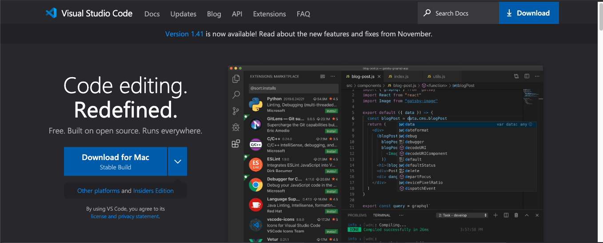

# Day 1 - Rangkuman

## VSCODE
Pertama berkenalan dengan editor yang akan sering digunakan yaitu vscode, 
pengenalan fitur-fitur di [vscode](https://code.visualstudio.com/) dan cara membuat shortcut `console.log()` agar membuat pekerjaan lebih cepat





Aku *sedang* belajar **menulis** dengan [markdown](https://en.wikipedia.org/wiki/Markdown).
*bold text*
1. satu
2. dua
3. tiga

--- 
`this for write some codes`


--- 

[Go to Website](http://yerros.github.io)

```
{
  "firstName": "John",
  "lastName": "Smith",
  "age": 25
}
```

~~The world is flat.~~

- [x] Write the press release
- [ ] Update the website
- [ ] Contact the media


[](https://twitter.com/intent/follow?screen_name=yerros)